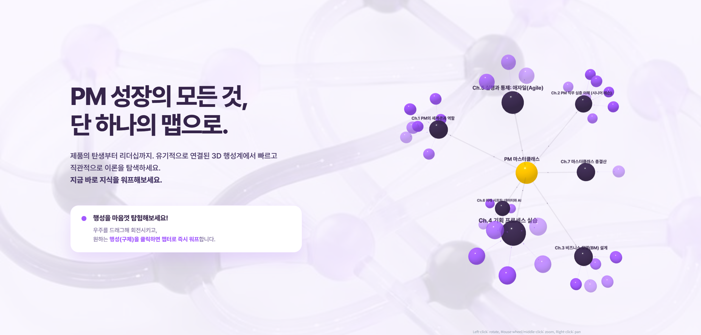
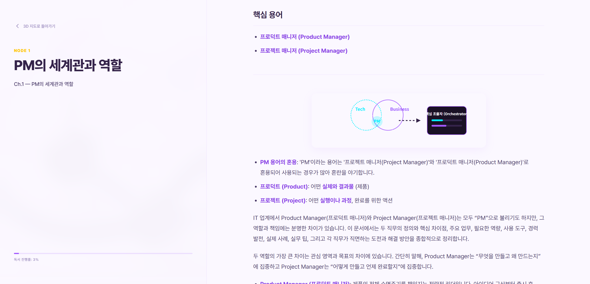

# AboutPM: PM 마스터클래스 지식 네트워크

**AboutPM**은 PM(Product Manager) 지망생 및 시니어 PM들을 위한 방대한 도메인 지식을 시각화하고 탐험할 수 있도록 설계된 인터랙티브 커리큘럼 플랫폼입니다.

## 🚀 주요 기능

- **3D 지식 그래프 (Obsidian Style)**: `react-force-graph-3d`를 활용하여 PM의 방대한 지식 체계를 우주 공간의 연결된 노드 형태로 시각화합니다.
- **인터랙티브 러닝 UX**: 노드를 클릭하면 해당 개념의 깊은 곳으로 카메라가 워프하며, 상세한 교재 내용을 읽을 수 있습니다.
- **토스(Toss) 스타일 UI**: 깨끗한 타이포그래피, 넓은 여백, 그리고 부드러운 애니메이션을 통해 프리미엄 독서 경험을 제공합니다.
- **유치원생 비유 (Kindergarten Analogy)**: 어려운 PM 개념을 누구나 이해할 수 있는 쉬운 비유와 3D 에셋을 통해 먼저 학습합니다.

## 🖼 Screenshots

### 🌌 3D 지식 네트워크 허브 (Main Hub)

- **우주 탐험 UX**: 모든 챕터가 유기적으로 연결된 3D 성계에서 마우스 드래그로 회전하고, 노드를 클릭하여 즉시 워프할 수 있습니다.
- **직관적 위계**: 챕터별 크기와 색상 구분을 통해 전체 커리큘럼의 흐름을 한눈에 파악합니다.

### 📖 프리미엄 독서 경험 (Lesson Detail)

- **압도적 가독성**: 토스 디자인 시스템 영감을 받은 세련된 타이포그래피와 여백을 제공합니다.
- **핵심 정보 구조**: 학습 목표, 핵심 용어, 본문, 그리고 실무 체크리스트로 구성된 체계적인 레이아웃을 갖추고 있습니다.

## 🛠 Tech Stack

- **Core**: React, TypeScript, Vite
- **Visuals**: Three.js, React-Force-Graph-3D
- **Content**: React-Markdown, Remark-GFM
- **Styling**: Vanilla CSS (Toss Design System inspired)

## 📂 Project Structure

- `src/`: 프론트엔드 소스 코드 및 3D 그래프 로직
- `MD/`: PM 교육용 원본 마크다운 자료 (Single Source of Truth)
- `public/`: 정적 자산 및 3D 모델

---
© 2026 AboutPM Project. 모든 권리 보유.
